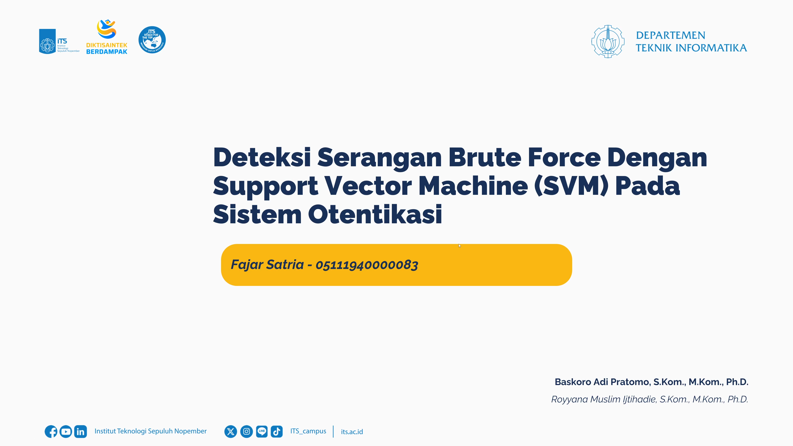

# 🏁 Tugas Akhir (TA) - Final Project

**Nama Mahasiswa**: Fajar Satria<br>
**NRP**: 05111940000083<br>
**Judul TA**: Deteksi Serangan Brute Force Dengan Support Vector Machine (SVM) Pada Sistem Otentikasi<br>
**Dosen Pembimbing**: Baskoro Adi Pratomo, S.Kom., M.Kom., Ph.D.<br>
**Dosen Ko-pembimbing**: Royyana Muslim Ijtihadie, S.Kom., M.Kom., Ph.D.<br>

---

## 📺 Demo Aplikasi  

[](https://www.youtube.com/watch?v=rgVhdNgaESQ)  
*Klik gambar di atas!
 untuk menonton demo*

---


## 🛠 Panduan Instalasi & Menjalankan Software  

### Prasyarat  
- Pastikan Anda telah menginstal prasyarat berikut sebelum menjalankan project ini:
  - Python 3.11.9+
  - pip 24.0+
  - Jupyter Notebook 4.2.5+
- Seluruh dependensi Python tercantum dalam requirements.txt, namun berikut adalah versi yang digunakan secara eksplisit:
  - Flask==3.1.1
  - joblib==1.5.1
  - numpy==2.2.6
  - pandas==2.2.3
  - scikit-learn==1.5.1
  - tqdm==4.67.1

### Langkah-langkah  
1. **Clone Repository**  
   ```bash
   git clone https://github.com/Informatics-ITS/ta-khuchuz.git
   ```
2. **Instalasi Dependensi**
   ```bash
   cd ta-khuchuz
   pip install -r requirements.txt  
   ```
3. **Jalankan Aplikasi Flask**
   ```bash
   python check.py
   ```
4. **Buka laman aplikasi**<br>
   `http://127.0.0.1:5050`
5. **Masukkan Logs**<br>
   Sesuaikan dengan template berikut
   ```txt
   index,timestamp,username,ip_address,status_login
   ```
   berikut adalah sample yg bisa digunakan
   ```txt
	20,1753164010071,user_normal3,192.168.1.1,1
	21,1753164013071,user_normal1,192.168.1.3,1
	22,1753164016071,user_normal2,192.168.1.10,1
	23,1753164019071,user_normal1,192.168.1.9,1
	24,1753164022071,user_normal2,192.168.1.5,1
	25,1753164025071,user_normal3,192.168.1.10,1
	26,1753164028071,user_normal1,192.168.1.10,1
	27,1753164031071,user_normal1,192.168.1.1,1
	28,1753164034071,user_normal2,192.168.1.4,1
	29,1753164037071,user_normal2,192.168.1.6,1
	30,1753164040071,user_brute,10.0.0.1,0
	31,1753164040571,user_brute,10.0.0.1,0
	32,1753164041071,user_brute,10.0.0.1,0
	33,1753164041571,user_brute,10.0.0.1,1
	34,1753164042071,user_brute,10.0.0.1,0
	35,1753164042571,user_brute,10.0.0.1,0
	36,1753164043071,user_brute,10.0.0.1,0
	37,1753164043571,user_brute,10.0.0.1,0
	38,1753164044071,user_brute,10.0.0.1,0
	39,1753164044571,user_brute,10.0.0.1,0
	40,1753164045071,user_brute,10.0.0.1,0
	41,1753164045571,user_brute,10.0.0.1,0
	42,1753164046071,user_brute,10.0.0.1,0
	43,1753164046571,user_brute,10.0.0.1,0
	44,1753164047071,user_brute,10.0.0.1,0
	45,1753164047571,user_brute,10.0.0.1,0
	46,1753164048071,user_brute,10.0.0.1,0
	47,1753164048571,user_brute,10.0.0.1,1
	48,1753164049071,user_brute,10.0.0.1,0
	49,1753164049571,user_brute,10.0.0.1,0
	50,1753164050071,user_brute,10.0.0.1,1
	65,1753164060071,user_rbf_2,10.0.0.2,0
	66,1753164060471,user_rbf_3,10.0.0.2,0
	67,1753164060871,user_rbf_0,10.0.0.2,1
	68,1753164061271,user_rbf_0,10.0.0.2,1
	69,1753164061671,user_rbf_5,10.0.0.2,1
	70,1753164062071,user_rbf_8,10.0.0.2,1
	71,1753164062471,user_rbf_4,10.0.0.2,0
	72,1753164062871,user_rbf_2,10.0.0.2,0
	73,1753164063271,user_rbf_4,10.0.0.2,0
	74,1753164063671,user_rbf_9,10.0.0.2,0
	75,1753164064071,user_rbf_5,10.0.0.2,1
	76,1753164064471,user_rbf_7,10.0.0.2,0
	77,1753164064871,user_rbf_5,10.0.0.2,1
	78,1753164065271,user_rbf_5,10.0.0.2,0
	79,1753164065671,user_rbf_9,10.0.0.2,0
	80,1753164066071,user_rbf_4,10.0.0.2,1
   ```
6. **Selesai**<br>
	Tabel berisi hasil prediksi dan fitur fitur yang digunakan

---

## 📚 Dokumentasi Tambahan

### Training ulang (jika perlu)
1. **Siapkan Datasets**

	Buka laman [Kaggle RBA Datasets](#-informasi-dataset)
	
	Unduh dataset sebagai file zip (berukuran ~1GB)
	
	Tunggu hingga proses unduh selesai
	
	Unzip, lalu pindahkan file `rba-dataset.csv` dari hasil unduhan ke folder `datasets`

2. **Lakukan Preprocessing Data**

	Masuk ke folder `preprocessing`
	
	Jalankan skrip Python dari urutan 1_* hingga 4_*:

		1*_ untuk pembersihan data

		2*_ untuk transformasi

		3*_ untuk rekayasa fitur

		4*_ untuk penyusunan subset final

        Proses ini akan menghasilkan file siap latih, seperti `dataset-final.csv`

3. **Buka Jupyter Notebook**

	Masuk ke folder `notebooks`

	Buka salah satu notebook sesuai model yang ingin dilatih:

		`sgd none *.ipynb` untuk model SVM Linear (SGDClassifier loss hinge)

		`svc none *.ipynb` untuk model SVM Nonlinear (SVC RBF Kernel)

    Jalankan Notebook

        Notebook akan memuat data hasil preprocessing dan melatih model sesuai konfigurasi.

        Model dan scaler yang dihasilkan akan disimpan sebagai file .pkl dan siap digunakan untuk prediksi.
4. **Periksa models hasil training**
	
	Masuk ke folder `models`
	
	Periksa apakah sudah muncul model yang telah dilakukan training ulang
	
	Misal `svm_bruteforce_final_nonlinear_none.pkl` dan `svm_scaler_final_nonlinear_none.pkl`

5. **Menjalankan model hasil training**
	
	Pada folder utama
	
	lakukan perubahan pada file `check.py` line 9 dan 10
	
	ubah sesuai nama model (file .pkl) yang didapatkan pada langkah sebelumnya
	
6. **Selesai**
	
	Jalankan ulang aplikasi seperti pada tahap [Langkah-langkah](#langkah-langkah) mulai poin 3 hingga selesai
---

## 🗃️ Informasi Dataset

Dataset yang digunakan dalam tugas akhir ini berasal dari RBA-Dataset yang tersedia secara publik melalui platform Kaggle. Dataset ini berisi log aktivitas autentikasi pengguna pada sebuah sistem online, termasuk informasi seperti waktu login, alamat IP, status keberhasilan login, dan informasi perangkat.

Seluruh data digunakan murni untuk keperluan penelitian dan pengembangan sistem deteksi serangan brute force menggunakan pendekatan pembelajaran mesin. Dataset telah melalui proses seleksi dan transformasi untuk memastikan tidak mengandung informasi pribadi sensitif, serta disesuaikan agar tetap menjaga kerahasiaan dan privasi pengguna.

Sumber asli dataset:

- [🔗 RBA Dataset – Kaggle](https://www.kaggle.com/datasets/dasgroup/rba-dataset)

---

## ⁉️ Pertanyaan?

Hubungi:
- Penulis: [05111940000083@student.its.ac.id]
- Pembimbing Utama: [baskoro@if.its.ac.id]
- Ko-Pembimbing: [roy@if.its.ac.id]